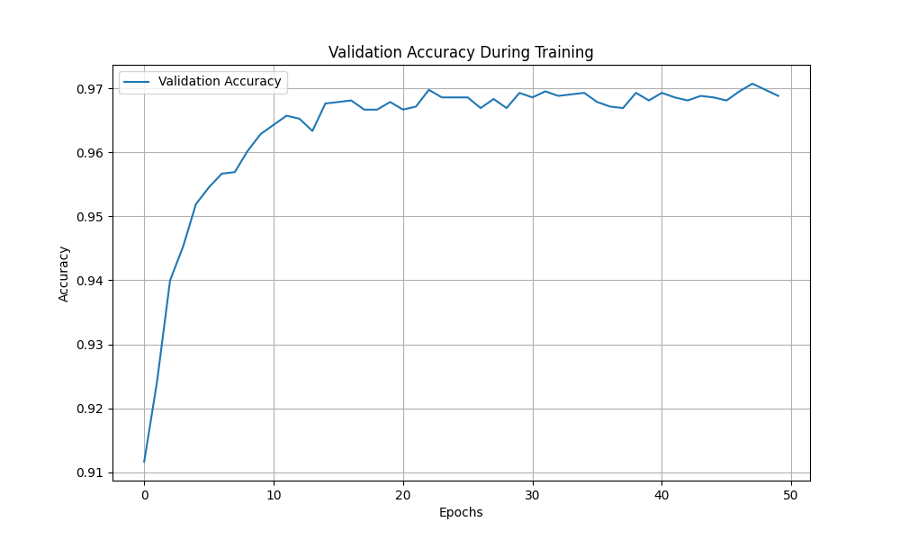

# MNIST Handwritten Digit Classification


A neural network implementation with backpropagation to classify handwritten digits from the MNIST dataset, achieving **97.19% accuracy** on the test dataset.

## Project Overview

This project implements an Artificial Neural Network (ANN) with backpropagation for the MNIST handwritten digit classification task. The implementation:

- Uses a neural network with at least one hidden layer
- Provides a flexible architecture to easily change the number of neurons in hidden layers
- Splits data into training (70%), validation (10%), and testing (20%) sets
- Achieves over 97% classification accuracy

## Performance

### Training Progress

The graph below shows the validation accuracy improvement during training:



### Classification Results

Test set accuracy: **97.19%**

Per-class accuracy:
- Digit 0: 98.28%
- Digit 1: 99.23%
- Digit 2: 97.16%
- Digit 3: 96.58%
- Digit 4: 96.78%
- Digit 5: 95.58%
- Digit 6: 98.09%
- Digit 7: 97.31%
- Digit 8: 96.65%
- Digit 9: 95.94%

## Network Structure

The Artificial Neural Network architecture consists of:

- **Input Layer**: 784 neurons (28×28 pixels of MNIST images)
- **Hidden Layer**: 128 neurons with sigmoid activation
- **Output Layer**: 10 neurons (one for each digit 0-9) with softmax activation

## Implementation Details

- **Activation Functions**: Sigmoid for hidden layers, Softmax for output layer
- **Weight Initialization**: Xavier/Glorot initialization
- **Learning Rate**: 0.01
- **Training**: Mini-batch gradient descent with batch size of 64
- **Epochs**: 50

## Setup Instructions

1. Ensure you have Python 3.7+ installed on your system.

2. Install the required dependencies:
   ```
   pip install -r requirements.txt
   ```

3. Make sure the MNIST dataset file `mnist_data.csv` is in the same directory as the code.

## Usage

Run the main script:
```
python mnist_classifier.py
```

The script will:
- Load the MNIST dataset
- Split it into training, validation, and testing sets
- Train the neural network
- Display the training progress
- Generate a plot of validation accuracy
- Evaluate the model and show detailed results

## Modifying the Network Architecture

To customize the neural network architecture, modify the `hidden_sizes` parameter in the `main()` function:

```python
# Single hidden layer with 256 neurons
hidden_sizes = [256]

# Two hidden layers with 128 and 64 neurons respectively
hidden_sizes = [128, 64]

# Three hidden layers
hidden_sizes = [256, 128, 64]
```

## Weight Update Equations

The network uses backpropagation with gradient descent to update weights:

1. **Forward Pass**:
   - Z^(l) = A^(l-1) · W^(l) + b^(l)
   - A^(l) = sigmoid(Z^(l)) for hidden layers
   - A^(output) = softmax(Z^(output)) for output layer

2. **Backward Pass**:
   - Output error: δ^(output) = A^(output) - y
   - Hidden error: δ^(l) = (δ^(l+1) · W^(l+1)^T) ⊙ sigmoid_derivative(A^(l))
   - Weight gradients: dW^(l) = A^(l-1)^T · δ^(l)
   - Bias gradients: db^(l) = sum(δ^(l), axis=0)
   - Update: W^(l) = W^(l) - η * dW^(l), b^(l) = b^(l) - η * db^(l)

## Detailed Documentation

A comprehensive report is available in the `mnist_report.md` file. 